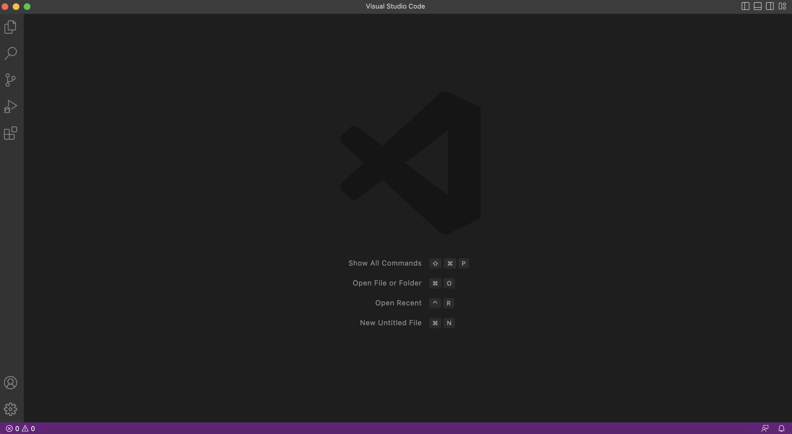

# How to log Into a Course Specific-Account on ing6
### Step 1: Installing VSCode
To begin with, you will make your way to [VScode's Website](https://code.visualstudio.com/) and proceed to follow the instructions provided by the site and download on your computer.\
***Note:*** VScode has support for all major operating systems such as Mac and Windows!\
Once installed, you should be able to open up the application that looks similair to do this image below.\
***Note:*** Your VSCode may look different compared to mine due to different settings in play!

### Step 2: Remotely Connecting
***Note:*** This is being done on Mac a Unix operating system. Therefore, Git won't be neeeded for instalation. (Windows Users Please Download the latest version of [Git](https://gitforwindows.org/))\
You are going to want to use ssh, but in order to do so we will have to open up a new terminal on VScode. (Ctrl or command + shift + ` or under the Terminal menu --> New Terminal). The command you will be using will look like this, but replace the **zz** with the letters in your course specific account.
```sh
$ ssh cs15lsp23zz@ieng6.ucsd.edu
```
Since this is most likely the first time you ever connected to the server you may be prompted with a message that will look like so:
```sh
The authenticity of host 'ieng6.ucsd.edu (128.54.70.227)' can't be established.
RSA key fingerprint is SHA256:ksruYwhnYH+sySHnHAtLUHngrPEyZTDl/1x99wUQcec.
Are you sure you want to continue connecting (yes/no/[fingerprint])?
```
Type yes and press enter, then enter your password. The output should look like so:
```sh
Last login: Thu Mar 16 12:37:14 2023 from 100.91.69.180
Attempting to create directory /home/linux/ieng6/cs15lsp23/cs15lsp23zz/perl5
Hello cs15lsp23zz, you are currently logged into ieng6-203.ucsd.edu

You are using 0% CPU on this system

Cluster Status 
Hostname     Time    #Users  Load  Averages  
ieng6-201   14:35:01   14  0.10,  0.15,  0.17
ieng6-202   14:35:01   15  0.05,  0.16,  0.20
ieng6-203   14:35:01   12  0.00,  0.11,  0.18

 
Fri Apr 07, 2023  2:37pm - Prepping cs15lsp23
```
