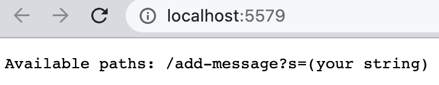

### Part 1
The code for the StringServer is shown below
```java
import java.io.IOException;
import java.net.URI;

class StringHandler implements URLHandler {
    String s = "";

    public String handleRequest(URI url){
        if (url.getPath().equals("/")){
            return String.format("Available paths: /add-message?s=(your string)");
        }else{
            if (url.getPath().contains("/add-message")) {
                String[] parameters = url.getQuery().split("=");
                if (parameters[0].equals("s")) {
                    s += parameters[1] + "\n";
                    return s;
                }
            }
            return "404 Not Found!";
        }
    }
}

class StringServer{
    public static void main(String[] args) throws IOException {
        if(args.length == 0){
            System.out.println("Missing port number! Try any number between 1024 to 49151");
            return;
        }

        int port = Integer.parseInt(args[0]);

        Server.start(port, new Handler());
    }
}
```
Once you have succesfully written your program, you will then proceed in typing this command on the terminal. Will look like so when successful.
```ssh
javac Server.java StringServer.java
java StringServer 5579
Server Started! Visit http://localhost:5579
```
***NOTE:*** You may choose whatever port you desire as long as it's between 1024 to 49151.\
Visit http://localhost:5579 it should look like:

