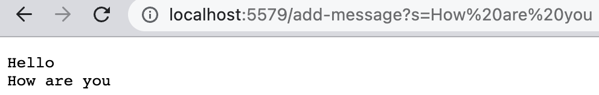

### Part 1
The code for the StringServer is shown below
```java
import java.io.IOException;
import java.net.URI;

class StringHandler implements URLHandler {
    String s = "";

    public String handleRequest(URI url){
        if (url.getPath().equals("/")){
            return String.format("Available paths: /add-message?s=(your string)");
        }else{
            if (url.getPath().contains("/add-message")) {
                String[] parameters = url.getQuery().split("=");
                if (parameters[0].equals("s")) {
                    s += parameters[1] + "\n";
                    return s;
                }
            }
            return "404 Not Found!";
        }
    }
}

class StringServer{
    public static void main(String[] args) throws IOException {
        if(args.length == 0){
            System.out.println("Missing port number! Try any number between 1024 to 49151");
            return;
        }

        int port = Integer.parseInt(args[0]);

        Server.start(port, new Handler());
    }
}
```
Once you have succesfully written your program, you will then proceed in typing this command on the terminal. Will look like so when successful.
```ssh
javac Server.java StringServer.java
java StringServer 5579
Server Started! Visit http://localhost:5579
```
***NOTE:*** You may choose whatever port you desire as long as it's between 1024 to 49151.\
Visit http://localhost:5579 it should look like:
\
Great! Now that you have launched your server, go ahead and try some of your own paths with the path shown below:
```
/add-message?s=<string>
```
***Examples:***\
Starting with ```/add-message?s=Hello ``` if done correctly it should look like so:
\
Great! Now go ahead and try the other path ```/add-message?s=How are you``` if done correctly is should look like so:
\
### Part 2
Failure-inducing input:
```java
@Test
  public void testReversedFail() {
    int[] input1 = {2, 1};
    assertArrayEquals(new int[]{1, 2}, ArrayExamples.reversed(input1));
  }
```
Non Failure-inducing input:
```java
@Test
  public void testReversedPass(){
    int[] input3 = {  };
    assertArrayEquals(new int[]{  }, ArrayExamples.reversed(input3));
  }
```
Symptom:
\
Before Code:
```java
static int[] reversed(int[] arr) {
    int[] newArray = new int[arr.length];
    for(int i = 0; i < arr.length; i += 1) {
      arr[i]=newArray[arr.length - i - 1];
    }
    return newArray;
  }
```
After Code:
```java
static int[] reversed(int[] arr) {
    int[] newArray = new int[arr.length];
    for(int i = 0; i < arr.length; i += 1) {
      newArray[arr.length - i - 1] = arr[i];
    }
    return newArray;
  }
```
Why it works:\
This fix works since instead of swapping the indexes we are now focused on replacing them into the new array which was created in the begining of the program.
### Part 3
Something that I learned from Week 2's lab was how to create a webserver which could be usefull down the line in terms of applying them to proffessional standards. Being able to use java to create the server was something new as I use to create Minecraft servers off of the jar pack Minecraft provided on their official website without knowing exactly what it does.
