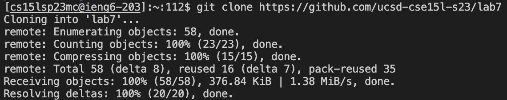
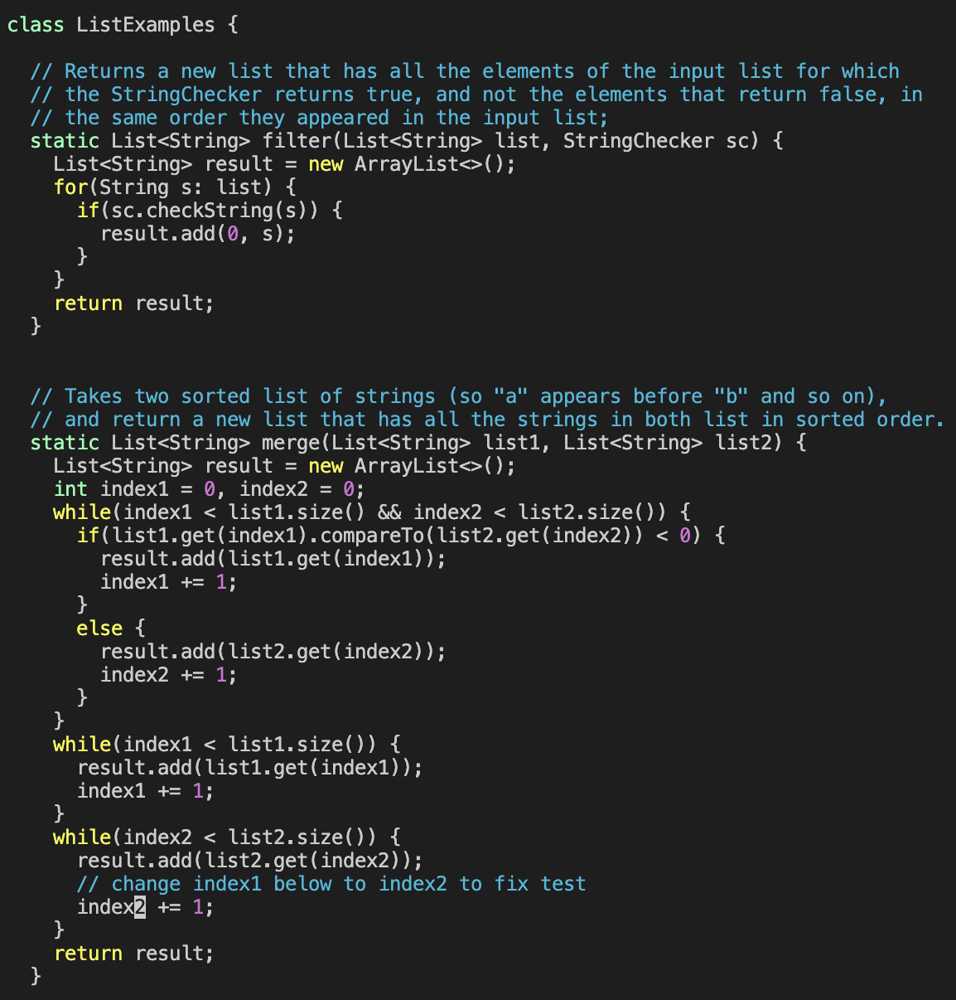

# Lab Report 4
## 1. Log into ieng6
Beging by logging into your ieng6 account by entering ```ssh cs15lsp23zz@ieng6.ucsd.edu``` into the terminal. Replace the zz with the letters in your course specific account. After entering, ```Password:``` should pop up which in turn will permit the user (you) to enter their/your password. It should look something similar to the image below.\

## 2. Clone your fork of the repository from your Github account
Now you will clone the fork of the repository through your account on Github. You do this by inputting ```git clone https://github.com/ucsd-cse15l-s23/lab7``` within the terminal. It should look like so:

## 3. Run the tests, demonstrating that they fail
First check all available paths you have by using ```ls```. Then use the command ```cd lab7``` to change directories to the working environment which is the **lab7** directory. Then use ```ls``` once more to make sure our required file of ```test.sh``` exists. Once certain proceed to use the command ```bash test.sh``` to run what is in the file. Results look like so:

## 4. Edit the code file to fix the failing test
You can view the code by entering ```vim ListExamples.java``` Then, begin editing the file to fix the appearing failing test. You can edit the code by inserting ```</index1><enter><n><n><n><n><n><n><n><n><n><l><l><l><l><l><x><i><2><esc><:wq><enter>```. This should not only allow you to edit the text but save it as well. The ```</index1>``` searches for anything after the slash, in this case index1. The user then must press ```<enter>```. Next, with just 9 clicks of ```<n>``` (for next character(s) searched) and 5 clicks of ```<l>``` (to move right on the line, you're brought to the line you must make your edit. The ```<x>``` removes a character, the ```<i>``` puts the user in insert mode, and the ```<2>``` replaces the existing 1 in order to fix the bug. The ```<esc>``` takes the user out of insert mode and into normal mode, and ```<:wq>``` finally allows the user to save and quit the file. The user concludes by pressing ```<enter>```.

## 5. Run the tests, demonstrating that they now succeed
You will now run the tests again. Use your arrow keys, in this case ```<up<up>``` ,to find ```bash test.sh```. Use ```bash test.sh``` to conduct the tests again.

## 6. Commit and push the resulting change to your Github account (you can pick any commit message!)
You can finally commit by entering git commit -a. After this, write your commit message. My message was "Committed!"

